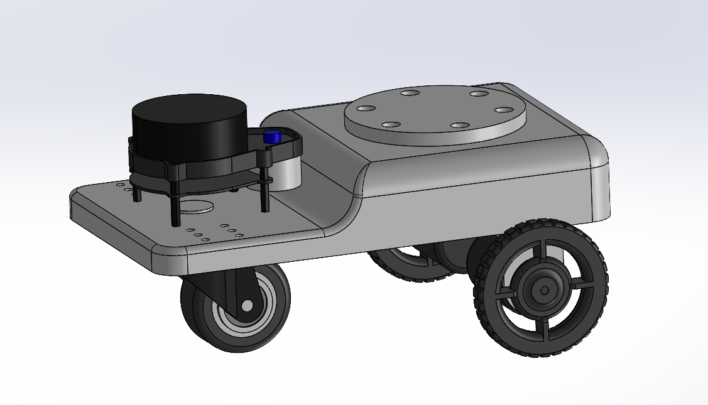

# ROS 2 Warehouse Simulation & Consensus-Based task distributer

A robust **ROS 2 Humble** and **Gazebo Fortress** simulation for multi-robot warehouse automation. This project focuses on decentralized path planning (Nav2) combined with a centralized consensus-based task allocation system.


- robot's model:
<p align="center">
  
</p>

---

## Workspace Architecture

This project follows a professional "Separation of Concerns" architecture:

```text
src/
├── bringup_sim/
│   ├── launch/                  # Master launch files (Sim + RViz + Bridge)
│   ├── config/                  # RViz, Bridge YAML, and Nav2 params
│   └── maps/                    # Generated SLAM maps
│
├── fleet_manager/
│   ├── fleet_manager/           # Python nodes for Task Allocation
│   └── ...                      # Consensus algorithm logic
│
├── gazebo_sim/                  # GZ world
│   ├── worlds/
│   └── models/
│
└── warehouse_robot_description/
    ├── urdf/
    └── meshes/
```

---

## Quick Start
1. Prerequisites
Ensure you have Ubuntu 22.04 and ROS 2 Humble installed. You will also need Gazebo Fortress and the ROS-GZ bridge.
```text
# Install Gazebo Fortress and ROS 2 Bindings
sudo apt-get install ros-humble-ros-gz \
                     ros-humble-slam-toolbox \
                     ros-humble-navigation2 \
                     ros-humble-nav2-bringup \
                     ros-humble-xacro \
                     ros-humble-robot-state-publisher
```

2. Build the Workspace
```text
# Create a workspace directory (if you haven't already)
mkdir -p ~/warehouse_ws
cd ~/warehouse_ws

# Clone this repository
git clone https://github.com/andytsai104/ros2_warehouse_simulation.git

# Build packages
colcon build --symlink-install
source install/setup.bash
```

3. Launch Simulation
We use a modular launch file that handles the Robot, Gazebo, RViz, and the ROS-GZ Bridge automatically.

*hint: Use the pop-up teleop window to drive the robot.*

3.1 Basic Simulation (Drive Around):
```text
ros2 launch bringup_sim gazebo_sim.launch.py
```

3.2 Simulation with Mapping (SLAM):
```text
ros2 launch bringup_sim gazebo_slam.launch.py
```
*Tip: to get a better map, use q/z to adjust speed ≈ 0.15 and turn ≈ 0.3*

Save the map (run this in another terminal):
```text
ros2 run nav2_map_server map_saver_cli -f ./src/bringup_sim/maps/warehouse_map
```
This will generate `warehouse_map.yaml` and `warehouse_map.pgm` inside `consensus_warehouse_robots/src/bringup_sim/maps`, which can be used later for localization and navigation runs.


---
## Key Features

* **Advanced Physics:** Custom inertia tensors and friction coefficients (`mu1`/`mu2`) tuned for realistic skid-steering/differential drive in Gazebo Fortress.
* **Sensor Fusion:**
    * **Lidar:** GPU-accelerated Ray Sensor mounted on `lidar_link`.
    * **Odometry:** DiffDrive plugin publishing to `/odom` and `/tf`.
* **ROS-GZ Bridge:** YAML-configured bridge for scalable topic communication (`/cmd_vel`, `/scan`, `/tf`).
* **Mapping:** Integrated `slam_toolbox` for generating 2D occupancy grids of the warehouse.

---

## Roadmap & TODO
### Phase 1: Simulation Basics
- [x] Robot Design: 2-Wheel Differential Drive with Caster (Low friction turning).
- [x] Simulation: Migration from Gazebo Classic to Fortress.
- [x] Sensors: Lidar implementation and TF tree alignment.
- [x] Mapping: SLAM Toolbox integration.

### Phase 2: Navigation & Control
- [ ] Nav2 Setup: Configure Costmaps (Inflation layers) and Path Planners.
- [ ] Waypoints: Test autonomous navigation to specific (x,y) coordinates.
- [ ] Multi-Robot Spawning: Create launch files to spawn /robot1 and /robot2 with separate namespaces.

### Phase 3: Fleet Management (The Core Logic)
- [ ] Task Manager Node: Create the "Auctioneer" that broadcasts tasks.
- [ ] Bidder Nodes: Create the logic where robots calculate path costs using Nav2's ComputePathToPose.
- [ ] Consensus Algorithm: Implement the decision logic (e.g., lowest bid wins).

### Phase 4: Analysis & Metrics
- [ ] Data Logger: Record metrics (Total distance traveled, Task completion time, Idle time).
- [ ] Comparison: Compare "Consensus" performance vs. "Random Assignment" or "Nearest Neighbor".

---

## Maintainer
**Andy Tsai**  
M.S. Robotics & Autonomous Systems @ ASU  
📧 andystsai1040@gmail.com  
🌐 [LinkedIn link](https://www.linkedin.com/in/chih-hao-tsai/)
🌐 [Github Profile](https://github.com/andytsai104)

---
